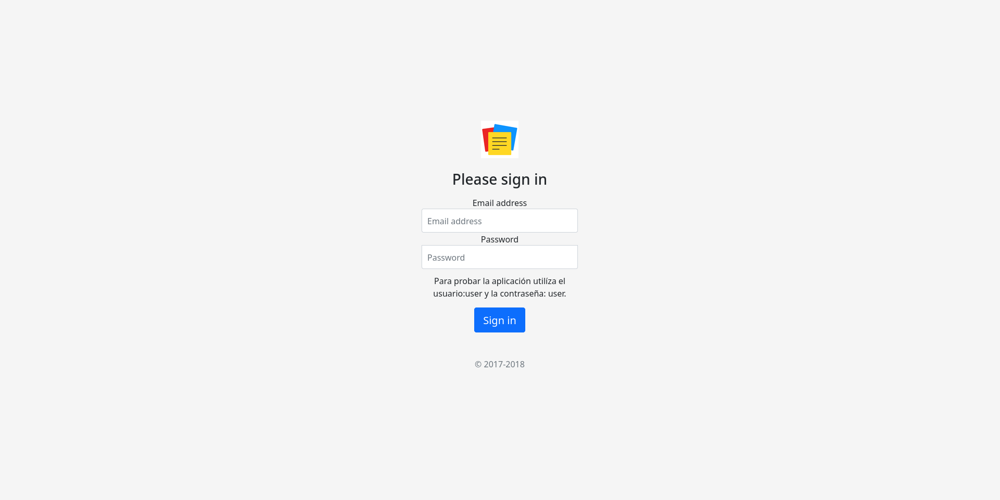
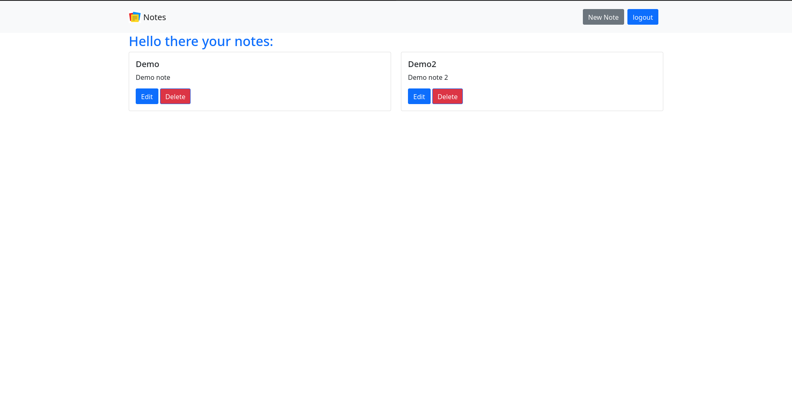

# Crud de notas con login

## Tecnologias utilizadas
- Thymeleaf
- Spring Security
- h2
- Bootstrap 

## Correr demo

Primero construir la aplicacion con:

 `mvn install`

 Despues ejecutar el jar generado con java.

  `java -jar target/thymeleaf-0.0.1-SNAPSHOT.jar`

Con docker despues de genear el jar, construir la imagen de docker con.

`docker build -t notas .`

`docker run notas -p 8080:8080`

